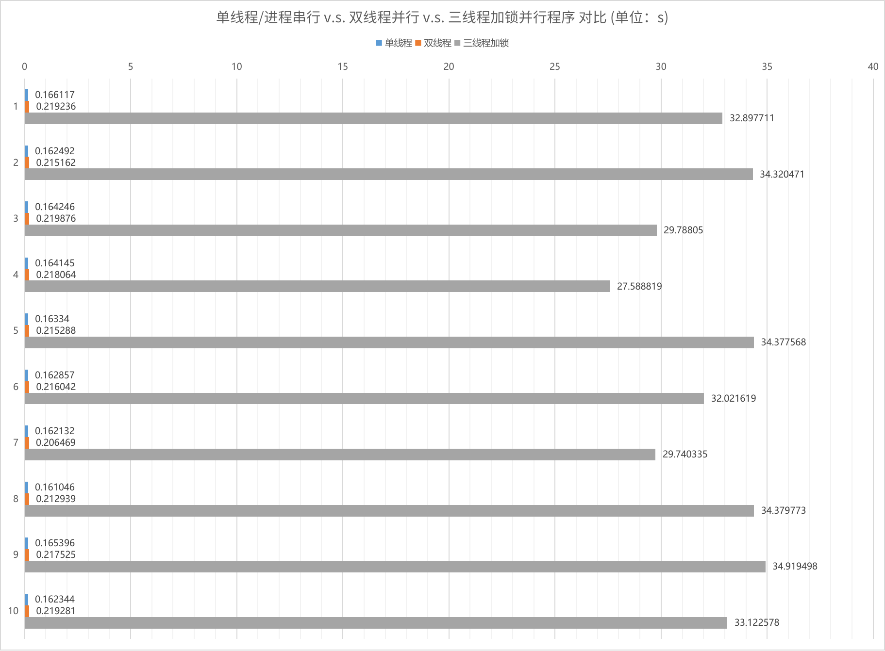
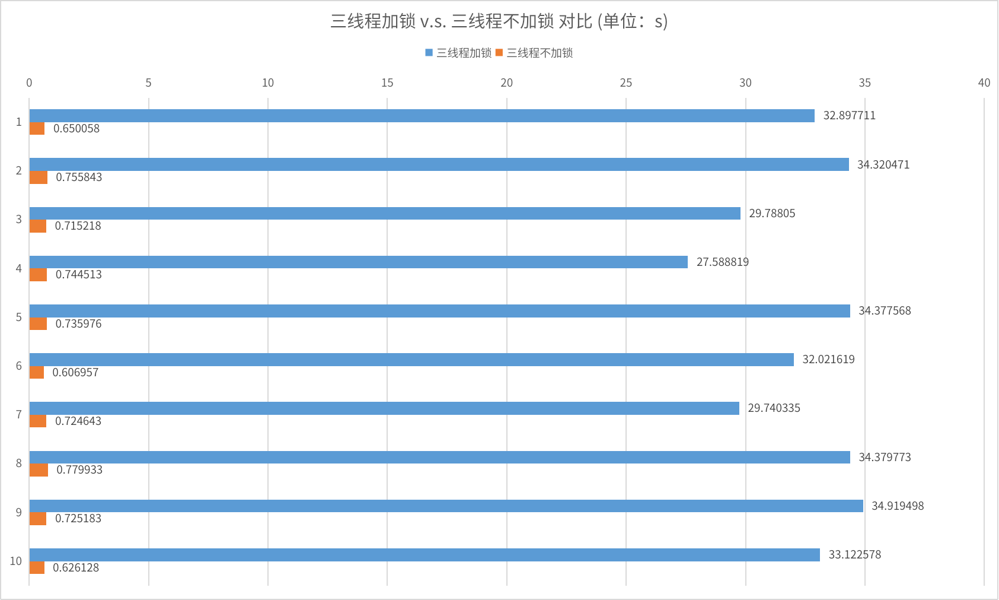

# lab5 多核多线程编程及性能分析

## 实验环境

- Machine：82NC Lenovo XiaoXinPro 14IHU 2021
- Processor: 8 × 11th Gen Intel® Core™ i5-11300H @ 3.10GHz
- Memory: 15.4 GiB of RAM
- OS：Arch Linux
- Kernel Version：6.5.9-arch2-1 (64-bit)

本实验程序均采用 makefile 方式构建运行，详见 `lab5/makefile`

## 5-1 观察实验平台物理 CPU、CPU 核心和逻辑 CPU 的数目

### 物理 CPU

在计算机系统中，物理 CPU（Physical CPU）是指实际的物理处理器芯片。每个物理 CPU 芯片通常由多个处理核心（Cores）组成，每个核心都可以独立执行指令。

物理 CPU 可以通过唯一的标识符进行标识，其中包括以下几个关键属性：

1. 物理 ID（Physical ID）：物理 ID 是指物理 CPU 的唯一标识符。对于具有多个物理 CPU 的系统，每个物理 CPU 都有一个唯一的物理 ID。
2. 核心 ID（Core ID）：核心 ID 是指物理 CPU 内的每个处理核心的唯一标识符。对于具有多个核心的物理 CPU，每个核心都有一个唯一的核心 ID。

物理 ID 和核心 ID 的作用是在多 CPU 系统中标识和区分不同的物理 CPU 和核心。操作系统和相关软件可以使用这些标识符来管理和调度任务、线程以及资源的分配。例如，操作系统可以根据物理 ID 和核心 ID 来将任务分配给特定的物理 CPU 和核心，以实现负载均衡和优化性能。

多路服务器、大型主机系统、集群系统一般可以配置多个物理 CPU；常规微机、笔记本电脑一般只配备 1 个物理 CPU。

```zsh
# dsy @ arch in ~ [21:39:52] 
$ grep 'physical id' /proc/cpuinfo|sort|uniq|wc -l
1
```

使用命令查看我的机器物理 CPU 数目如上，可以看到我的笔记本电脑只有一个物理 CPU。

### CPU 核心

CPU 核心数目指的是计算机的中央处理器（CPU）中的独立处理核心的数量。每个 CPU 核心都是一个可以独立执行指令的处理单元，具有自己的寄存器组、缓存和执行单元。

多核处理器（Multi-core Processor）是一种将多个 CPU 核心集成到单个物理芯片上的设计。这些核心可以同时执行多个线程或指令，从而提高计算机的整体性能和并行处理能力。

例如，一台计算机上的 CPU 核心数目可以是 2、4、8 或更多，具体取决于 CPU 芯片的设计和型号。每个核心都可以独立执行任务，因此，具有更多 CPU 核心的计算机通常可以更有效地处理多线程工作负载、并行任务和多任务操作。

```zsh
# dsy @ arch in ~ [21:48:14] 
$ grep 'cpu cores' /proc/cpuinfo|uniq|awk -F ':' '{print $2}'
 4
```

使用命令查看我的机器 CPU 核心数数目如上，可以看到 CPU 核心数为 4 。

### 逻辑 CPU

逻辑 CPU（Logical CPU），也被称为虚拟 CPU，是指通过超线程（Hyper-Threading）或虚拟化技术在物理 CPU（Physical CPU）上创建的虚拟处理器。

超线程是一种技术，通过在单个物理 CPU 核心上模拟多个逻辑 CPU，使其能够同时执行多个线程。通过超线程，每个物理 CPU 核心可以模拟出多个逻辑 CPU，每个逻辑 CPU 独立执行指令，拥有自己的寄存器组和执行单元。这样可以提高处理器的利用率，使得处理器能够更好地处理多线程工作负载。

逻辑 CPU 可以被操作系统和相关软件识别为独立的处理器，因此在操作系统中可以看到多个逻辑 CPU。例如，如果一个物理 CPU 支持超线程技术，并且启用了超线程，操作系统会将每个逻辑 CPU 视为一个独立的处理器。这样，操作系统可以将不同的线程或进程分配给不同的逻辑 CPU 进行并行执行。

值得注意的是，逻辑 CPU 并不是真正的独立物理 CPU 核心，而是通过虚拟化技术在物理 CPU 上创建的虚拟处理器。每个逻辑 CPU 共享物理 CPU 的资源，如缓存和执行单元。虽然逻辑 CPU 可以提高处理器的并发性和多任务处理能力，但由于资源的共享，逻辑 CPU 的性能可能不及物理 CPU 核心。

逻辑 CPU 的个数可以通过系统信息或任务管理器等工具查看。

- 对于不支持超线程的处理器，逻辑 CPU 就是物理 CPU 的核心数之和；
- 对于支持超线程的处理器，逻辑 CPU 的数量通常是物理 CPU 核心数之和的两倍。

```zsh
# dsy @ arch in ~ [21:49:36] 
$ cat /proc/cpuinfo| grep "processor"|wc -l
8
```

使用命令查看我的机器逻辑 CPU 数量如上，可以看到是 CPU 核心数的两倍，因此支持虚拟化技术和超线程。

## 5-2 单线程/进程串行 v.s. 双线程并行 v.s. 三线程加锁并行程序 对比

程序功能：求从 1 一直到 `APPLE_MAX_VALUE` (100000000) 相加累计的和，并赋值给 `apple` 的 `a` 和 `b` ；求 `orange` 数据结构中的 `a[i]+b[i]` 的和，循环 `ORANGE_MAX_VALUE` (1000000) 次。

### 单线程/进程串行

数据结构定义在 `lab5/structure.h` 中，以便后续程序复用，内容如下：

```c
#ifndef STRUCTURE_H
#define STRUCTURE_H

#define ORANGE_MAX_VALUE 1000000
#define APPLE_MAX_VALUE 100000000
#define MSECOND 1000000

struct apple
{
    unsigned long long a;
    unsigned long long b;
};

struct orange
{
    int a[ORANGE_MAX_VALUE];
    int b[ORANGE_MAX_VALUE];
};

#endif // STRUCTURE_H

```

单线程串行测试程序为 `lab5/single.c` ，使用 `time.h` 中的 `clock()` 函数获取 CPU 时钟状态以计算程序运行时间。

使用单线程只在 main 函数中计算 apple 和 orange ，程序内容如下：

```c
#include <stdio.h>
#include <time.h>

#include "structure.h"

int main(int argc, char * argv[])
{
    struct apple app;
    struct orange oran;

    clock_t start, end;
    double cpu_time_used;

    start = clock();

    for (int i = 0; i < APPLE_MAX_VALUE; i++) {
        app.a += i;
        app.b += i;
    }

    unsigned long long sum;
    for (int i = 0; i < ORANGE_MAX_VALUE; i++) {
        sum += oran.a[i] + oran.b[i];
    }

    end = clock();
    cpu_time_used = ((double) (end - start)) / CLOCKS_PER_SEC;

    printf("Time elapsed: %f seconds.\n", cpu_time_used);

    return 0;
}
```

### 双线程并行

双线程并行测试程序为 `lab5/double.c` ，采用任务分解的方法，将互不相关的计算 apple 值和计算 orange 值的两部分代码分解为两个线程，实现线程级并行执行，程序内容如下：

```c
#include <stdio.h>
#include <time.h>
#include <pthread.h>

#include "structure.h"

void * apple(void * arg)
{
    struct apple * app = (struct apple *) arg;

    for (int i = 0; i < APPLE_MAX_VALUE; i++) {
        app->a += i;
        app->b += i;
    }

    return NULL;
}

void * orange(void * arg)
{
    struct orange * oran = (struct orange *) arg;

    unsigned long long sum;
    for (int i = 0; i < ORANGE_MAX_VALUE; i++) {
        sum += oran->a[i] + oran->b[i];
    }

    return NULL;
}

int main(int argc, char * argv[])
{
    struct apple app;
    struct orange oran;

    clock_t start, end;
    double cpu_time_used;

    start = clock();

    pthread_t pid[2];
    pthread_create(&pid[0], NULL, apple, &app);
    pthread_create(&pid[1], NULL, orange, &oran);

    pthread_join(pid[0], NULL);
    pthread_join(pid[1], NULL);

    end = clock();

    cpu_time_used = ((double) (end - start)) / CLOCKS_PER_SEC;

    printf("Time elapsed: %f seconds.\n", cpu_time_used);

    return 0;
}
```

### 三线程加锁并行

通过数据分解的方法，计算 apple 的值可以分解为两个线程，一个用于计算 apple a 的值，另外一个线程用于计算 apple b 的值。但两个线程存在同时访问 apple 的可能性，需要加锁访问该数据结构。

三线程加锁并行测试程序为 `lab5/triple.c` ，程序内容如下：

```c
#include <stdio.h>
#include <time.h>
#include <pthread.h>

#include "structure.h"

pthread_mutex_t mutex;

void * apple_a(void * arg)
{
    struct apple * app = (struct apple *) arg;

    for (int i = 0; i < APPLE_MAX_VALUE; i++) {
        pthread_mutex_lock(&mutex);
        app->a += i;
        pthread_mutex_unlock(&mutex);
    }

    return NULL;
}

void * apple_b(void * arg)
{
    struct apple * app = (struct apple *) arg;

    for (int i = 0; i < APPLE_MAX_VALUE; i++) {
        pthread_mutex_lock(&mutex);
        app->b += i;
        pthread_mutex_unlock(&mutex);
    }

    return NULL;
}

void * orange(void * arg)
{
    struct orange * oran = (struct orange *) arg;

    unsigned long long sum;
    for (int i = 0; i < ORANGE_MAX_VALUE; i++) {
        sum += oran->a[i] + oran->b[i];
    }

    return NULL;
}

int main(int argc, char * argv[])
{
    struct apple app;
    struct orange oran;

    pthread_mutex_init(&mutex, NULL);

    clock_t start, end;
    double cpu_time_used;

    start = clock();

    pthread_t pid[3];
    pthread_create(&pid[0], NULL, apple_a, &app);
    pthread_create(&pid[1], NULL, apple_b, &app);
    pthread_create(&pid[2], NULL, orange, &oran);

    pthread_join(pid[0], NULL);
    pthread_join(pid[1], NULL);
    pthread_join(pid[2], NULL);

    end = clock();

    cpu_time_used = ((double) (end - start)) / CLOCKS_PER_SEC;

    printf("Time elapsed: %f seconds.\n", cpu_time_used);

    return 0;
}
```

### K-Best 测量对比

参照参考文献，采用K-Best 测量方法，对比分析单线程/进程、双线程、三线程加锁程序的运行时间差异，对比结果以条形统计图的形式呈现如下：



可以看到单线程和双线程相比，使用多线程并没有达到预期，可能是由于线程创建和管理的开销大于了运行时间本身。

三线程加锁时间远远大于前两种方式，可能是由于频繁的上锁解锁消耗了更多资源导致运行时间变长。

## 5-3 三线程加锁 v.s. 三线程不加锁 对比

### 三线程加锁

三线程加锁并行测试程序为 `lab5/triple.c` ，与 5-2 中的程序内容一致，不再赘述。

### 三线程不加锁

在 5-2 中三线程加锁方案，计算 apple 的两个并行线程访问的是 apple 的不同元素，没有加锁的必要。所以修改 apple 的数据结构，删除读写锁代码，通过不加锁来提高性能。

三线程不加锁并行测试程序为 `lab/triple_nolock.c` ，程序内容如下：

```c
#include <stdio.h>
#include <time.h>
#include <pthread.h>

#include "structure.h"

void * apple_a(void * arg)
{
    struct apple * app = (struct apple *) arg;

    for (int i = 0; i < APPLE_MAX_VALUE; i++) {
        app->a += i;
    }

    return NULL;
}

void * apple_b(void * arg)
{
    struct apple * app = (struct apple *) arg;

    for (int i = 0; i < APPLE_MAX_VALUE; i++) {
        app->b += i;
    }

    return NULL;
}

void * orange(void * arg)
{
    struct orange * oran = (struct orange *) arg;

    unsigned long long sum;
    for (int i = 0; i < ORANGE_MAX_VALUE; i++) {
        sum += oran->a[i] + oran->b[i];
    }

    return NULL;
}

int main(int argc, char * argv[])
{
    struct apple app;
    struct orange oran;

    clock_t start, end;
    double cpu_time_used;

    start = clock();

    pthread_t pid[3];
    pthread_create(&pid[0], NULL, apple_a, &app);
    pthread_create(&pid[1], NULL, apple_b, &app);
    pthread_create(&pid[2], NULL, orange, &oran);

    pthread_join(pid[0], NULL);
    pthread_join(pid[1], NULL);
    pthread_join(pid[2], NULL);

    end = clock();

    cpu_time_used = ((double) (end - start)) / CLOCKS_PER_SEC;

    printf("Time elapsed: %f seconds.\n", cpu_time_used);

    return 0;
}
```

### K-Best 测量对比

在加锁与不加锁耗时的运行时间差异如下图所示：



可以看到加锁与不加锁运行时间相差悬殊，频繁的上锁解锁操作消耗大量资源与时间导致运行时间过长。

不加锁的实现明显达到了缩短运行时间的预期。

## 5-4 针对 Cache 的优化


## 5-5 CPU 亲和力对并行程序影响

